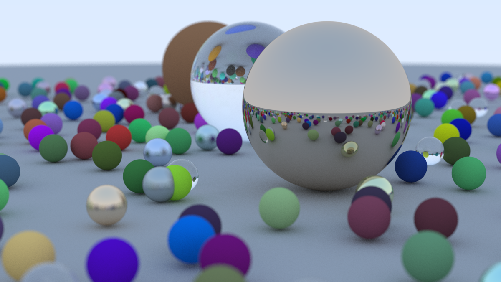

# Multithreaded Raytracer

This is a CPU ray tracer built in C++17 with no dependencies beyond the standard library, which I implemented by following a [guide](#citation).
It renders scenes of spheres with matte, metal and glass materials - reflections, refraction, shadows, antialiasing, depth of field - and writes out a PPM image file.

**My addition**: it makes use of workers by splitting the image into 32x32 tiles, with each worker claiming tiles from a shared atomic counter and joining them so that they finish before anything is written.

## Renders



The above is the book's final scene, rendered at 1200x675 with 500 samples per pixel and max depth 50, containing 484 spheres. It took about 2 minutes (~115s) to render on 10 threads.

## Features

- **Sphere geometry**: every ray is tested against every sphere in the scene and the nearest thing it hits is the one that gets shaded. Hits closer than 0.001 are ignored to avoid shadow acne
- **Three materials**:
    - Matte (Lambertian): scatters light in every direction, weighted towards the surface normal
    - Metal: reflects like a mirror, with a fuzz setting that blurs the reflection
    - Glass (dielectric): bends light passing through it by Snell's law, reflects instead when the angle is too steep to refract and turns mirror-like at glancing angles
- **Recursive reflection and refraction**: light bounces from surface to surface, picking up colour at each bounce, until it escapes to the sky, is absorbed by a surface or reaches the bounce limit
- **Antialiasing**: each pixel is sampled many times at slightly different points and averaged, so edges come out smooth rather than jagged. Noise falls as 1/sqrt(N), so quadrupling the samples halves it
- **Positionable camera**: can be placed anywhere, pointed at any target, rotated around its viewing axis and given any field of view
- **Defocus blur**: rays start from a random point on a disk instead of a single point. Only objects at the focus distance stay sharp; others nearer or further are blurry
- **Gamma correction**: linear colour is square-rooted before writing as viewers expect gamma-encoded data. Without it, the image is too dark
- **Parallel tile rendering**: my addition - 32x32 tiles claimed from an atomic counter, rendered across every CPU core at once
- **PPM output**: plain-text P3, written once after every worker has joined
- **Deterministic output**: each tile seeds its generator from its own index, so the image doesn't depend on which thread rendered what

## How It Works

1. **Cast a ray.** For each pixel, a ray is aimed at a randomly chosen point inside that pixel. With defocus blur switched on it starts from a random point on the camera's lens disk rather than from a single point, which is what produces the blur.
2. **Find what it hits.** The ray is tested against every sphere in the scene and the nearest intersection is kept, along with the surface normal and the material at that point.
3. **Scatter and repeat.** The material decides where the ray goes next - scattered randomly for matte, reflected for metal, bent or reflected for glass - and the whole process runs again from the new starting point. It ends when the ray escapes into the sky, is absorbed by a surface or runs out of bounces.
4. **Work the colour back.** The sky supplies the colour at the end of the chain, and it is multiplied by each surface the ray touched on the way back, which is how objects tint what they reflect. Rays that were absorbed or ran out of bounces contribute black.
5. **Average.** The steps above are repeated many times per pixel and averaged, then gamma corrected on the way out.

Every pixel is worked out independently of every other one, which is what makes this straightforward to run in parallel.

## Parallel Tile Renderer

- **How the work is split**: the image is cut into 32x32 tiles, with the tiles at the right and bottom edges clipped where the image doesn't divide evenly. At 1200x675 that's 836 tiles and the bounds of each one are built into a list before any thread starts and never modified again, so every worker can read it freely. Each worker claims a tile using a shared std::atomic<int> counter, starting at zero, that ensures that no index is given twice. Each worker then loops: the counter's current value is handed to the worker and the counter is incremented, both in one indivisible step, the tile at that index is rendered and repeat. A worker stops when the index it receives is past the end of the list - the counter running out is the stop signal. The main thread then joins every worker and afterwards writes the file.

- **Why no lock**: a data race needs two threads accessing the same memory location and at least one of them writing. Since the tiles are disjoint rectangles, no two workers compute the same index into the framebuffer. The atomic counter is the only thing two threads touch at the same address, and therefore the only thing that needs synchronisation. By joining the workers, it is ensured that everything the workers wrote is visible to the main thread and the writing begins only once they finish.

- **Seeding**: each thread has its own generator so that no two threads share the same RNG state. The generator is reseeded every time each thread starts working on a tile, using the tile's index. Because the index doesn't depend on which worker claimed the tile, each tile draws the same numbers on every run. This is done so that the output is comparable against the single-threaded render for a correctness check.

### Timing

| Threads | Median | Speedup | Efficiency |
| :--- | ---: | ---: | ---: |
| 1 | 11.39s | 1.00× | 100% |
| 2 | 6.18s | 1.84× | 92% |
| 4 | 3.71s | 3.07× | 77% |
| 8 | 2.58s | 4.42× | 55% |
| 10 | 2.34s | 4.87× | 49% |

Each figure is the median of three runs on an Apple M5, which has 4 performance and 6 efficiency cores. Release build with a fixed seed, so the only variation between runs is machine noise. Rendered at 1200x675 into 836 tiles, at **10 samples per pixel rather than the 500 used for the image above** - these runs were for timing, not for quality. The thread count was set in the source and rebuilt for each row.

The seconds are a fact about this machine on the day; the speedup column is the part worth comparing.

### Why it isn't 10x

Amdahl's Law is the usual answer to this. It holds here, but it isn't what's doing the limiting. The only part of the render that can't be shared out is writing the PPM at the end, once every worker has joined. That takes 0.117s out of 11.39s, so roughly 1% of the work is sequential, and the law puts the ceiling at about 97x. I'm getting 4.87x, so the bound is satisfied and nowhere near tight. It's a speed limit well above the speed I'm actually going.

It's also worth being clear about what the law does and doesn't model. It assumes N identical workers that don't interfere with each other. This machine has neither, so the formula is always a valid upper bound but a poor prediction of what I'll actually get.

I only found that out by checking. Fitting Amdahl's formula to the first set of timings suggested the sequential part was around 13%, which would have meant about 1.5 seconds spent writing the file. Timing the write directly gave 0.117s, so the estimate was out by more than a factor of ten and something else had to be responsible.

That something was the reference count on the materials. HitRecord stored a shared_ptr it never actually owned, and copying it on every hit meant bumping an atomic counter. Nearly every ray hits the ground sphere, so all ten threads were updating the same counter at the same address, and the cache line holding it kept bouncing between cores. Replacing it with a plain pointer cut about 19% off the 10-thread render and took the speedup from 3.98x to 4.87x.

What showed it was contention rather than just the cost of copying is that the single-threaded time didn't move at all, only 1.7%, which is inside the normal run-to-run variation. Copying costs the same whether one thread does it or ten. Only contention gets cheaper when there are fewer threads fighting over the same memory.

The rest is the hardware. Working backwards from the table, each performance core is worth about 0.77x of speedup and each efficiency core about 0.30x, and std::thread gives no say in which core a thread ends up on, so ten threads was never ten equal workers. This last part is me reading the numbers against what the chip is, rather than something I isolated and measured, so it's the likely explanation and not a proven one.

## Design Choices

1. **An atomic counter instead of a mutex and condition variable.**
   **Why**: a condition variable exists so a worker can sleep until more work turns up. Here the full list of tiles is built before any worker starts and no more work ever arrives, so there is nothing to wait for and the condition variable would have no job to do. A mutex would be similarly idle, since it protects a section of code where several things have to happen without interruption, and all that happens here is one integer going up by one. That is already a single uninterruptible operation, so there is nothing to guard.

2. **32x32 tiles.**
   **Why**: bigger tiles bring back the problem tiling was meant to solve, because one slow tile leaves a worker busy while the others run out of work. Smaller tiles mean more time spent handing work out relative to doing it. 32 sits in the middle, and it also keeps the pixels each worker is writing well away from each other in memory, so threads shouldn't end up fighting over the same cache line. I picked it as a sensible starting point rather than by testing a range of sizes, so treat it as a reasonable choice and not a tuned one.

3. **Seeding the generator from the tile index rather than the thread.**
   **Why**: seeding per thread would mean the random numbers a pixel gets depend on which worker happened to pick up its tile, so the image would change from run to run and there would be nothing stable to compare against. Seeding per tile removes the scheduler from the picture entirely.

4. **No lock on the framebuffer.**
   **Why**: tiles never overlap, so two workers never write to the same pixel. There is no race to prevent, so a lock would only cost time. This is covered in more detail above.

5. **Calling it a parallel tile renderer and not a thread pool.**
   **Why**: a thread pool keeps its workers alive between batches of work, puts them to sleep when there is nothing to do, and usually feeds them a queue of arbitrary tasks. These threads exist for one render and stop once the tiles run out. Using the wrong name would suggest the code does more than it does.

## Verification

- **Same image at any thread count**: rendering at 1, 4 and 10 threads and comparing with `cmp` finds no differing bytes. This is what the per-tile seeding exists to make possible.
- **No data races**: a ThreadSanitizer build reports none.
- **Every tile gets rendered**: an unrendered tile would be a solid black rectangle, since the framebuffer starts zeroed. No pure black pixels at 1200x675, 400x225 or 50x28. The last is only 2 tiles, so 8 of the 10 workers find the counter already past the end and stop without rendering anything.
- **Clean build**: no compiler warnings and nothing from clang-tidy.

The first one holds for the same build, which is the point since it's the threading being tested. It isn't a promise of the same image on another compiler, as `std::uniform_real_distribution` isn't specified exactly by the standard even though `std::mt19937` is.

## Build and Run

```bash
cmake -B build
cmake --build build
./build/raytracer > image.ppm
```

The build is Release unless you ask for something else. A Debug build renders the same image 33 times slower, which turns a two minute wait into about an hour.

As committed it renders at 500 samples per pixel and takes roughly two minutes on 10 threads. Lower `samples_per_pixel` for something faster and grainier; that and the rest of the image and camera settings sit at the bottom of `main.cpp`.

On macOS `open image.ppm` shows it in Preview. To convert it:

```bash
sips -s format png image.ppm --out image.png
```

## Project Structure

```
multithreaded-raytracer/
├── src/
│   ├── main.cpp          # Scene setup, camera configuration, timing
│   ├── vec3.h            # 3D vector, doubles as point and colour
│   ├── ray.h             # A ray: origin, direction, point at parameter t
│   ├── interval.h        # A [min, max] range, used for valid hit distances
│   ├── colour.h          # Gamma correction and PPM pixel output
│   ├── hittable.h        # Base class for anything a ray can hit, plus HitRecord
│   ├── hittable_list.h   # A collection of hittables, finds the nearest hit
│   ├── sphere.h          # Ray-sphere intersection
│   ├── material.h        # Matte, metal and glass scattering
│   ├── camera.h          # Ray generation, the tile loop and the worker threads
│   ├── tile.h            # A rectangular region of the image, one unit of work
│   ├── rtweekend.h       # Shared constants and the per-thread random generator
│   └── timer.h           # Steady-clock timer for measuring the render
├── images/
│   └── final-scene.png   # The render at the top of this file
├── CMakeLists.txt        # C++17, Release by default, warning flags
├── README.md             # This file
├── .gitignore            # Build directory
├── .clang-format         # Allman braces, 4-wide indent, 80 columns
└── .clang-tidy           # bugprone/modernize/readability, noisy checks disabled
```

## Citation

This was built following '[_Ray Tracing in One Weekend_](https://raytracing.github.io/books/RayTracingInOneWeekend.html)':
- **Title (series)**: Ray Tracing in One Weekend Series
- **Author**: Peter Shirley, Trevor David Black, Steve Hollasch
- **Version/Edition**: v4.0.2
- **Date**: 2025-04-25
- **URL (series)**: https://raytracing.github.io
- **URL (book)**: https://raytracing.github.io/books/RayTracingInOneWeekend.html

## License

This repository is under the MIT license, see [LICENSE](LICENSE).

The book's own code is released under CC0, a public domain dedication, so it places no licensing conditions on anything built from it.
